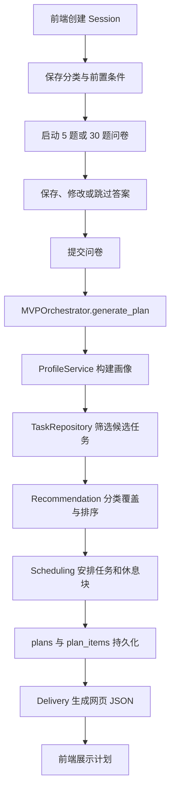

# MVP 新增内容运行与调试指南

本文面向第一次接触 FastAPI、PostgreSQL 和断点调试的同学，解释本次新增的三个核心内容：

- `mvp_orchestrator.py`：把分散模块串成一条产品工作流。
- `docs/api.md`：记录前后端共同遵守的接口约定。
- `tests/live_core_flow.ps1`：通过真实 HTTP 请求验证完整链路。

本文只说明当前已经接入 `main.py` 的功能。当前主流程包括 Session、Questionnaire、Profile、Task Repository、Recommendation、Scheduling 和网页 Delivery；Execution 与 Feedback 目前仍是独立模块，尚未接入主流程。

---

## 1. 三个新增内容分别解决什么问题

### 1.1 `mvp_orchestrator.py`：业务流程的总指挥

以前每个模块可以单独演示，但模块之间没有统一入口。例如 Profile 模块知道如何计算画像，却不知道应该在何时读取问卷；Scheduling 模块知道如何排时间，却不知道推荐任务从哪里来。

`MVPOrchestrator` 的作用是按固定顺序调用这些模块，并把上一步的结果转换成下一步需要的数据：

```text
已提交问卷
-> 构建画像
-> 按前置条件筛选任务
-> 选出最多 10 个推荐任务
-> 把推荐任务排入空闲时间
-> 保存计划
-> 生成网页展示数据
```

它本身不负责问卷打分算法、推荐排序算法或排程算法。它负责协调这些算法，这种职责叫作 **Orchestration（编排）**。

### 1.2 `docs/api.md`：前后端之间的合同

接口文档说明：

- 前端应该请求哪个 URL。
- 使用 GET、POST、PUT、PATCH 还是 DELETE。
- JSON 请求体应该包含哪些字段。
- 成功时返回什么数据。
- 失败时可能出现哪些 HTTP 状态码。

它解决的是“前端和后端对同一个接口理解不一致”的问题。

### 1.3 `tests/live_core_flow.ps1`：真实链路验收脚本

单元测试通常只验证一个函数。`live_core_flow.ps1` 会像真实前端一样依次发送 HTTP 请求，因此可以同时发现以下问题：

- 后端没有启动或端口错误。
- FastAPI 路由与接口文档不一致。
- PostgreSQL 没有连接成功。
- 上一步返回的数据无法被下一步使用。
- 计划生成后无法再次从数据库读取。

---

## 2. 当前完整工作流



完整接口调用顺序如下：

1. `POST /api/v1/sessions` 创建会话。
2. `PUT /api/v1/sessions/{session_id}/preferences` 保存活动分类和约束。
3. `POST /api/v1/sessions/{session_id}/questionnaire/start` 开始问卷。
4. `PATCH /api/v1/sessions/{session_id}/questionnaire/answers/{question_id}` 保存每题答案。
5. `POST /api/v1/sessions/{session_id}/questionnaire/submit` 提交问卷。
6. `POST /api/v1/sessions/{session_id}/plan/generate` 生成计划。
7. `GET /api/v1/sessions/{session_id}/plan` 从 PostgreSQL 恢复最新计划。

统一成功响应：

```json
{
  "data": {},
  "error": null
}
```

统一失败响应：

```json
{
  "data": null,
  "error": {
    "code": "validation_error",
    "message": "请求参数不合法"
  }
}
```

---

## 3. `mvp_orchestrator.py` 的底层运行逻辑

### 3.1 依赖是如何装配的

后端从 `main.py` 的 `build_orchestrator()` 创建编排器，并把六个依赖交给它：

| 属性 | 实际对象 | 主要职责 |
| --- | --- | --- |
| `sessions` | `SessionService` | 验证会话存在且未过期，读取偏好 |
| `questionnaire` | `QuestionnaireService` | 读取问卷、题目和答案 |
| `tasks` | `TaskRepository` | 根据预算、时长、出行等条件筛选任务 |
| `profiles` | `PostgreSQLProfileRepository` | 保存和查询画像快照 |
| `plans` | `PostgreSQLPlanRepository` | 保存计划头和时间轴项目 |
| `delivery` | `WebDeliveryService` | 生成前端可直接展示的网页 JSON |

这种写法叫作 **依赖注入**：编排器只约定自己需要什么能力，不在内部写死具体数据库对象。这样测试时可以传入假仓储，真实运行时传入 PostgreSQL 仓储。

### 3.2 `generate_plan()` 的逐步执行过程

#### 第一步：验证 Session

```python
session = self.sessions.require_active(session_id)
```

后端根据 `session_id` 查询 PostgreSQL。不存在返回 404，过期返回 410。成功后得到 `session.preferences`，其中包含活动分类、预算、可用时长、出行和同行方式。

#### 第二步：确认问卷已经提交

```python
questionnaire = self.questionnaire.repository.get_questionnaire(session_id)
if questionnaire is None or not questionnaire.submitted:
    raise HTTPException(status_code=409, detail="问卷尚未提交")
```

这一步保护业务顺序。用户不能绕过问卷直接生成计划。

#### 第三步：读取题目和答案并转换数据类型

Questionnaire、Profile 各自有自己的 `Question` 和 `Answer` 数据类。字段相似，但它们属于不同模块。编排器显式转换后再交给 `ProfileService`，避免模块互相依赖内部实现。

#### 第四步：标准化前置条件

`_normalize_preferences()` 完成三类转换：

- 前端英文分类别名转换成中文分类，例如 `energy -> 活力充电`。
- 预算档位转换成数字上限，例如 `medium -> 40` 元。
- 时长档位转换成最大任务时长，例如 `half -> 270` 分钟。

它还为缺失字段填入默认值：`outing=any`、`company=both`。

如果分类为空或出现未知分类，立即返回 400，避免错误数据继续进入推荐算法。

#### 第五步：构建画像

`ProfileService.build()` 会：

1. 用 `question_id` 把题目和答案对应起来。
2. 检查是否缺题或出现不属于当前问卷的答案。
3. 跳过题使用中性分，反向题使用 `5 - value` 反向计分。
4. 按维度计算平均分。
5. 把 1～4 分标准化为 0～1：`(平均分 - 1) / 3`。
6. 生成新的 `profile_version` 并保存到 `profiles` 表。

例如某维度三题得分为 4、3、2，平均分为 3，标准化结果为：

```text
(3 - 1) / 3 = 0.67
```

#### 第六步：筛选候选任务

`_recommend()` 调用 `TaskRepository.search_tasks()`，只保留同时满足以下条件的任务：

- 状态为 `approved`。
- 预算不超过 `budget_limit`。
- 单项时长不超过 `max_duration`。
- 符合居家、附近或全城范围。
- 符合独处、结伴或两者皆可。
- 属于用户选择的分类。
- 如果指定了使用场景，任务至少匹配一个场景。

当前公共任务目录来自 `task_repository.py` 中人工审核的静态活动数据，不会实时爬取地图或商户信息。主流程的 Session、问卷、画像、计划和交付记录使用 PostgreSQL；公共任务目录目前不是数据库表。

#### 第七步：推荐并保证分类覆盖

`recommend_tasks()` 先按画像分数降序，再按时长、预算和 ID 排序。它执行两轮选择：

1. 第一轮从每个已选分类中至少取一个任务。
2. 第二轮用综合排序最靠前的任务补足，最多返回 10 个。

如果某个用户选择的分类在当前约束下没有候选任务，`missing_categories` 不为空，编排器返回 409，而不是生成一份缺少用户所选分类的计划。

#### 第八步：生成时间计划

编排器把推荐任务转换为 Scheduling 模块的 `Task`，然后调用 `build_schedule()`。

三种密度配置：

| 密度 | 最多任务数 | 任务间缓冲 | 安排几项后休息 | 休息时长 |
| --- | ---: | ---: | ---: | ---: |
| `light` | 2 | 20 分钟 | 1 | 30 分钟 |
| `balanced` | 4 | 15 分钟 | 2 | 20 分钟 |
| `full` | 6 | 10 分钟 | 3 | 15 分钟 |

排程器会验证时间窗口、任务 ID、任务时长和时间冲突，按画像分数优先排入任务，并确保计划至少包含一个休息块。无法排入的推荐任务会进入 `unscheduled_task_ids`。

#### 第九步：保存计划

`PostgreSQLPlanRepository.save()` 先写 `plans`，再逐条写 `plan_items`。两类写入位于同一个数据库连接上下文中，正常退出时提交；发生异常时连接事务回滚。

#### 第十步：网页交付

`_to_delivery_plan()` 把 Scheduling 的计划模型转换成 Delivery 模型。`WebDeliveryService.deliver()` 会验证任务不重叠，生成按时间排序的网页 JSON，并写入 `delivery_jobs`。

同一个 `session_id + plan_id + channel` 再次交付时使用 `ON CONFLICT ... DO UPDATE`，更新原记录而不是创建重复记录，这叫作 **幂等**。

### 3.3 `get_plan()` 为什么只需要 `session_id`

`PostgreSQLPlanRepository.get()` 会按以下规则查询：

```sql
WHERE session_id = %s
ORDER BY version DESC, created_at DESC
LIMIT 1
```

因此它返回该会话最新版本的计划，再根据 `plan_id` 查询全部 `plan_items` 并按时间排序。前端刷新后只要保留 `session_id`，就能恢复最新计划。

### 3.4 事务边界需要怎样理解

一次 `generate_plan()` 会调用多个仓储，每个仓储方法建立自己的 PostgreSQL 连接。因此：

- 单次画像保存是一个数据库事务。
- 单次计划和计划项保存是一个数据库事务。
- 单次网页交付保存是一个数据库事务。
- 整条“画像 → 计划 → 交付”目前不是一个跨模块的大事务。

如果计划已保存但交付失败，数据库可能已经存在计划而没有 `delivery_jobs`。MVP 可以通过重新生成或重新交付恢复；正式上线时可以增加统一事务、状态字段或补偿机制。

---

## 4. PostgreSQL 中新增的四张表

### 4.1 `profiles`：画像版本表

| 字段 | 含义 |
| --- | --- |
| `session_id` | 画像属于哪个会话 |
| `profile_version` | 同一会话的画像版本号 |
| `scores` | 各偏好维度的 0～1 分数，JSONB |
| `constraints` | 预算、时长、出行、同行等约束，JSONB |
| `confidence` | 有效回答数量占题目数量的比例 |
| `rule_version` | 本次画像使用的规则版本 |
| `created_at` | 创建时间 |

主键是 `(session_id, profile_version)`，所以一个会话可以保存多个画像快照。

### 4.2 `plans`：计划头表

| 字段 | 含义 |
| --- | --- |
| `id` | 计划 ID，例如 `plan_xxx` |
| `session_id` | 计划属于哪个会话 |
| `density` | `light`、`balanced` 或 `full` |
| `free_start` / `free_end` | 用户可用时间窗口 |
| `version` | 计划版本 |
| `parent_plan_id` | 调整计划时可记录上一版本 |
| `unscheduled_task_ids` | 未能排入时间窗口的任务 ID |
| `created_at` | 创建时间 |

### 4.3 `plan_items`：计划时间轴明细表

| 字段 | 含义 |
| --- | --- |
| `id` | 时间轴项目 ID |
| `plan_id` | 所属计划 |
| `task_id` | 对应任务 ID；休息块可以为空 |
| `title` / `category` | 展示标题和分类 |
| `start_at` / `end_at` | 开始与结束时间 |
| `kind` | `task` 或 `rest` |
| `status` | 当前任务状态，初始为 `pending` |
| `locked` | 是否为用户锁定的时间项 |

`plan_id` 外键带有 `ON DELETE CASCADE`。删除计划头时，对应明细会自动删除。

### 4.4 `delivery_jobs`：网页交付记录表

| 字段 | 含义 |
| --- | --- |
| `id` | 交付记录 ID |
| `session_id` / `plan_id` | 对应会话和计划 |
| `channel` | MVP 固定为 `web` |
| `status` | `ready` 或 `failed` |
| `payload_json` | 前端可直接展示的计划 JSON |
| `attempts` | 尝试次数，当前同步网页交付保持为 0 |
| `created_at` / `updated_at` | 创建和更新时间 |

以下 SQL 可以检查某个会话的结果。把 `<session_id>` 替换成真实值：

```sql
SELECT * FROM profiles
WHERE session_id = '<session_id>'
ORDER BY profile_version DESC;

SELECT * FROM plans
WHERE session_id = '<session_id>'
ORDER BY version DESC, created_at DESC;

SELECT pi.*
FROM plan_items AS pi
JOIN plans AS p ON p.id = pi.plan_id
WHERE p.session_id = '<session_id>'
ORDER BY pi.start_at;

SELECT * FROM delivery_jobs
WHERE session_id = '<session_id>'
ORDER BY created_at DESC;
```

---

## 5. `docs/api.md`、OpenAPI 和 Swagger 的关系

这四个概念不要混在一起：

| 名称 | 是什么 | 在本项目中的位置 |
| --- | --- | --- |
| FastAPI 路由 | 真正接收请求的 Python 代码 | `main.py` 中的 `@app.get()`、`@app.post()` 等 |
| OpenAPI | FastAPI 根据路由生成的机器可读接口描述 | `http://127.0.0.1:8000/openapi.json` |
| Swagger UI | 读取 OpenAPI 后生成的可点击调试网页 | `http://127.0.0.1:8000/docs` |
| 静态接口文档 | 给人阅读的重点说明 | `docs/api.md` |

修改路由或 Pydantic 模型后，Swagger 会在重启后自动变化；`docs/api.md` 不会自动变化，需要同步维护。

推荐的接口变更顺序：

1. 修改 Pydantic 输入模型和 FastAPI 路由。
2. 打开 `/openapi.json` 检查生成结构。
3. 在 `/docs` 中实际调用接口。
4. 更新 `docs/api.md`。
5. 更新自动化测试和前端调用。

---

## 6. 本地测试环境启动方法

所有 PowerShell 命令都应在 **Windows Terminal、PowerShell 或 PyCharm 的 Terminal 标签页**执行。不要把 `python -m ...` 粘贴到 Python Console，否则 Python 会把它当作代码并报 `SyntaxError`。

### 6.1 启动 PostgreSQL

```powershell
& "D:\pgsql18\pgsql\bin\pg_ctl.exe" status `
  -D "D:\pgsql18\data"
```

如果没有运行：

```powershell
& "D:\pgsql18\pgsql\bin\pg_ctl.exe" start `
  -D "D:\pgsql18\data" `
  -l "D:\pgsql18\data\postgres.log" `
  -o '"-p 5433"' `
  -w
```

验证端口：

```powershell
& "D:\pgsql18\pgsql\bin\pg_isready.exe" `
  -h 127.0.0.1 -p 5433 -d free_time_agent
```

成功标志是输出包含 `accepting connections`。

### 6.2 创建或更新 Python 虚拟环境

首次运行，或 `requirements.txt` 更新后，执行：

```powershell
Set-Location "D:\yxy1.0"
uv venv .venv --python 3.12
uv pip install --python .venv\Scripts\python.exe -r requirements.txt
```

第二条命令不能省略。仅创建 `.venv` 不会自动安装 FastAPI、psycopg 和用于接口测试的 `httpx2`。如果测试提示 `TestClient` 需要 `httpx2`，通常表示当前解释器没有重新安装最新的 `requirements.txt`。

验证解释器和关键依赖：

```powershell
.\.venv\Scripts\python.exe --version
.\.venv\Scripts\python.exe -m pip show fastapi psycopg httpx2
```

### 6.3 设置数据库环境变量

```powershell
Set-Location "D:\yxy1.0"
$env:SESSION_DATABASE_URL = `
  "postgresql://postgres:<password>@127.0.0.1:5433/free_time_agent"
```

这个变量只在当前 PowerShell 窗口有效。关闭窗口后需要重新设置。不要把真实密码写入 Python 文件、Markdown、`.env.example` 或 Git 提交。

### 6.4 启动后端

```powershell
Set-Location "D:\yxy1.0"
.\.venv\Scripts\python.exe -m uvicorn main:app `
  --host 127.0.0.1 `
  --port 8000
```

成功标志：

```text
Application startup complete.
Uvicorn running on http://127.0.0.1:8000
```

访问 `http://127.0.0.1:8000/docs`。如果根地址 `/` 返回 404，并不代表后端坏了，因为项目没有定义根路由。

### 6.5 启动前端

另开一个 PowerShell：

```powershell
Set-Location "D:\yxy1.0"
.\.venv\Scripts\python.exe -m http.server 5173 `
  --bind 127.0.0.1 `
  --directory frontend
```

打开 `http://127.0.0.1:5173/`。前端通过 `http://127.0.0.1:8000` 调用后端。

### 6.6 启动顺序和端口检查

推荐顺序：PostgreSQL → 后端 → 前端。

```powershell
Test-NetConnection 127.0.0.1 -Port 5433
Test-NetConnection 127.0.0.1 -Port 8000
Test-NetConnection 127.0.0.1 -Port 5173
```

对应端口的 `TcpTestSucceeded` 应为 `True`。

---

## 7. 如何使用 `tests/live_core_flow.ps1`

### 7.1 运行前提

- PostgreSQL 已启动。
- 后端已运行在 `127.0.0.1:8000`。
- 当前 PowerShell 位于 `D:\yxy1.0`。

运行：

```powershell
.\tests\live_core_flow.ps1
```

如果后端使用其他地址：

```powershell
.\tests\live_core_flow.ps1 -BaseUrl "http://127.0.0.1:8001"
```

### 7.2 脚本逐步做了什么

1. `Invoke-RestMethod -Method Post` 创建 Session，并提取 `$session.data.session_id`。
2. 把五类活动和前置条件转换为 JSON，调用保存偏好接口。
3. 启动 `quick` 问卷，从返回值读取 5 道题。
4. 使用 `foreach` 遍历题目，每题提交 `value=3`。
5. 提交问卷，使 `submitted` 变成 `true`。
6. 生成从当前时刻开始的 4 小时时间窗口。
7. 调用计划生成接口，触发画像、推荐、排程和网页交付。
8. 调用计划查询接口，验证计划能够从 PostgreSQL 恢复。
9. 输出摘要，方便人工验收。

预期结果类似：

```json
{
  "session_id": "sess_xxx",
  "questionnaire_total": 5,
  "submitted": true,
  "profile_rule": "<当前规则版本>",
  "covered_categories": [
    "乐享探索",
    "活力充电",
    "松弛疗愈",
    "社交连接",
    "自我成长"
  ],
  "plan_id": "plan_xxx",
  "plan_items": "<实际排入的项目数量>",
  "restored_plan_id": "plan_xxx"
}
```

`plan_id` 与 `restored_plan_id` 相同，说明刚生成的计划成功写入数据库，并能通过另一个 GET 请求恢复。

这个脚本会留下测试 Session，便于你继续在 Swagger、pgAdmin 或 PyCharm 中查询。完成学习后，可以调用：

```powershell
Invoke-RestMethod -Method Delete `
  -Uri "http://127.0.0.1:8000/api/v1/sessions/<session_id>/data"
```

该接口会清空 Questionnaire 数据、清空 Session 偏好并把阶段重置为 `interests`，但不会删除 Session 行，也不会删除已经生成的画像、计划和网页交付记录。

调试后若要彻底删除测试 Session，可在确认 ID 后执行：

```sql
BEGIN;
DELETE FROM delivery_jobs WHERE session_id = '<session_id>';
DELETE FROM sessions WHERE id = '<session_id>';
COMMIT;
```

`questionnaires`、`questionnaire_answers`、`profiles` 和 `plans` 使用指向 Session 的级联外键，`plan_items` 使用指向 Plan 的级联外键；`delivery_jobs` 当前没有 Session 外键，所以需要先显式删除。

---

## 8. PyCharm 调试配置

### 8.1 创建后端 Debug Configuration

在 PyCharm 中打开 `D:\yxy1.0`，依次进入：

```text
Run -> Edit Configurations -> + -> Python
```

设置：

| 配置项 | 值 |
| --- | --- |
| Name | `MVP Backend Debug` |
| Run kind | `Module name` |
| Module name | `uvicorn` |
| Parameters | `main:app --host 127.0.0.1 --port 8000` |
| Python interpreter | `D:\yxy1.0\.venv\Scripts\python.exe` |
| Working directory | `D:\yxy1.0` |
| Environment variables | `SESSION_DATABASE_URL=postgresql://postgres:<password>@127.0.0.1:5433/free_time_agent` |

调试时不要使用 `--reload`。自动重载会创建额外进程，可能导致断点停在另一个进程中。

### 8.2 推荐断点顺序

第一次调试不需要给每一行都加断点。先在函数入口加一组断点，让请求沿链路依次停下：

| 顺序 | 文件和函数 | 观察重点 |
| ---: | --- | --- |
| 1 | `main.py -> generate_plan()` | `session_id`、`body` |
| 2 | `mvp_orchestrator.py -> MVPOrchestrator.generate_plan()` | `request`、`session.preferences` |
| 3 | `profile_module.py -> ProfileService.build()` | `questions`、`answers`、`scores` |
| 4 | `mvp_orchestrator.py -> _normalize_preferences()` | `categories`、`budget_limit`、`max_duration` |
| 5 | `task_repository.py -> search_tasks()` | `candidates` 和筛选后数量 |
| 6 | `recommendation_module.py -> recommend_tasks()` | `ranked`、`covered`、`missing` |
| 7 | `scheduling_module.py -> build_schedule()` | `config`、`ranked`、`items`、`unscheduled` |
| 8 | `mvp_orchestrator.py -> PostgreSQLPlanRepository.save()` | `plan_query`、`item_query`、`plan.items` |
| 9 | `delivery_module.py -> WebDeliveryService.deliver()` | `payload` |
| 10 | `delivery_module.py -> PostgreSQLDeliveryRepository.save_or_get_web()` | `row`、`stored_payload` |

然后点击 PyCharm 顶部的 Debug 图标启动后端，再运行 `live_core_flow.ps1`。当请求到达断点时，程序会暂停，当前将要执行的代码行通常显示为蓝色或高亮背景。

### 8.3 调试按钮分别做什么

| 操作 | Windows 快捷键 | 含义 |
| --- | --- | --- |
| Resume Program | `F9` | 继续运行到下一个断点 |
| Step Over | `F8` | 执行当前行，但不进入函数内部 |
| Step Into | `F7` | 进入当前行调用的函数 |
| Smart Step Into | `Shift+F7` | 一行有多个函数时，选择要进入哪个 |
| Step Out | `Shift+F8` | 执行完当前函数并返回调用者 |
| Run to Cursor | `Alt+F9` | 直接运行到光标所在行 |
| Evaluate Expression | `Alt+F8` | 临时计算表达式，不修改代码 |

笔记本键盘可能需要同时按 `Fn`，例如 `Fn+F8`。也可以直接点击 Debug 工具窗口上方的对应图标。

### 8.4 Variables 应该看什么

程序停在断点后，底部 Debug 工具窗口的 **Threads & Variables（线程和变量）** 中可以展开：

- 局部变量，例如 `session_id`、`body`、`profile`。
- `self`，用于查看当前服务对象及其仓储依赖。
- 列表长度，例如 `len(candidates)`、`len(ranked)`。
- 字典内容，例如 `constraints`、`recommendation`。
- 数据库返回行，例如 `row`、`plan_row`、`item_rows`。

推荐在 Evaluate Expression 中依次检查：

```python
session.preferences
questionnaire.submitted
len(answers)
profile.scores
constraints
len(candidates)
recommendation["covered_categories"]
recommendation["missing_categories"]
plan.to_dict()
delivery.to_dict()
```

Evaluate Expression 中不要执行会写数据库的方法，例如 `self.plans.save(plan)`，否则可能人为制造重复写入。

---

## 9. 分层调试路线

一次从头跟到尾可能信息太多。建议分四轮：

### 第一轮：只看 HTTP 层

在 `main.py` 的 `generate_plan()` 打断点。从 Swagger 或脚本发请求，确认：

- `session_id` 与创建会话时得到的一致。
- `body.free_start`、`body.free_end` 已被 Pydantic 转成 `datetime`。
- `body.density` 是 `light`、`balanced` 或 `full`。

### 第二轮：看业务编排层

在 `MVPOrchestrator.generate_plan()`、`_normalize_preferences()` 和 `_recommend()` 打断点。确认每一步输入来自上一步，没有跳过问卷提交检查。

### 第三轮：看算法层

在 Profile、Recommendation 和 Scheduling 的入口打断点。重点比较：

```text
原始答案 -> 画像分数
全部任务 -> 约束筛选后的 candidates
candidates -> 最多 10 个 recommendation tasks
recommendation tasks -> 有时间顺序的 plan items
```

### 第四轮：看数据库层

在三个 PostgreSQL 仓储的 `save()` 或 `save_or_get_web()` 打断点。F8 执行 SQL 后，在 pgAdmin 中查询 `profiles`、`plans`、`plan_items` 和 `delivery_jobs`，确认 Python 对象已经变成数据库行。

---

## 10. 常见错误与处理

### 10.1 `RuntimeError: 启动服务前必须设置 SESSION_DATABASE_URL`

原因：运行配置没有环境变量，或变量只设置在另一个 PowerShell 窗口。

处理：在 PyCharm Debug Configuration 的 Environment variables 中设置连接串，然后重新启动 Debug。

### 10.2 Swagger 显示 `Failed to fetch`

依次检查：

1. PyCharm 控制台是否仍显示 Uvicorn 正在运行。
2. 当前 Swagger 地址是否为 `http://127.0.0.1:8000/docs`。
3. `Test-NetConnection 127.0.0.1 -Port 8000` 是否成功。
4. 断点是否暂停了后端；暂停时浏览器会一直等待，先按 F9。
5. 是否启动了两个后端进程争用 8000 端口。

### 10.3 PostgreSQL `connection refused` 或超时

先执行 `pg_ctl status` 和 `pg_isready`。再检查连接串端口是否为 5433，数据库名是否为 `free_time_agent`。

### 10.4 `relation ... does not exist`

通常是 pgAdmin 连接到了错误的端口或数据库。确认查询窗口连接的是：

```text
host=127.0.0.1
port=5433
database=free_time_agent
```

仓储对象在后端启动时执行 `CREATE TABLE IF NOT EXISTS`。如果表仍不存在，先检查后端启动日志是否出现数据库错误。

### 10.5 409：`问卷尚未提交`

计划接口执行得太早。先完成并提交问卷，再生成计划。

### 10.6 409：`当前约束下无法覆盖全部选择分类`

至少一个分类在预算、时长、出行、同行和场景约束下没有候选任务。检查返回的 `missing_categories`，放宽约束或补充对应任务数据。

### 10.7 422：请求参数不合法

Pydantic 在业务函数执行前拦截了请求。检查时间是否为 ISO 8601 格式、`free_end` 是否存在、`density` 拼写是否正确。Swagger 的 Response body 会指出错误字段位置。

### 10.8 断点不生效

- 确认使用 Debug，而不是 Run。
- 确认启动的是 `main:app`，不是单独运行旧模块。
- 去掉 Uvicorn 的 `--reload`。
- 确认浏览器请求的端口与 Debug 进程一致。
- 实心红点才是有效断点；灰色断点通常没有绑定到可执行代码。

---

## 11. 测试与验收

### 11.1 自动化测试

```powershell
Set-Location "D:\yxy1.0"
$env:SESSION_DATABASE_URL = `
  "postgresql://postgres:<password>@127.0.0.1:5433/free_time_agent"

.\.venv\Scripts\python.exe -m unittest discover `
  -s tests -p "test_*.py" -v

node --test tests/*.test.js
```

### 11.2 核心链路验收清单

- [ ] PostgreSQL 5433 端口可连接。
- [ ] 后端 8000 端口可访问 `/docs` 和 `/openapi.json`。
- [ ] 前端 5173 页面可打开。
- [ ] 创建 Session 返回 `sess_...`。
- [ ] 保存偏好后 Session 阶段发生变化。
- [ ] 快速版返回 5 题，深度版返回 30 题。
- [ ] 答案可以保存、覆盖、跳过并恢复进度。
- [ ] 未提交问卷时生成计划返回 409。
- [ ] 提交问卷后能生成画像和推荐结果。
- [ ] `covered_categories` 覆盖用户选择的全部分类。
- [ ] 计划项不存在时间重叠，并至少包含一个休息块。
- [ ] `plans` 与 `plan_items` 中能查询到计划。
- [ ] `delivery_jobs.channel` 为 `web`，状态为 `ready`。
- [ ] GET 计划返回的 `plan_id` 与生成结果一致。
- [ ] 刷新前端后仍能通过 Session 从 PostgreSQL 恢复数据。

---

## 12. 当前边界和下一步

当前版本是一条可运行、可测试的确定性 MVP 链路，但仍有以下边界：

- 公共任务目录来自代码中的审核数据，没有接入实时地图、商户或活动 API。
- 用户自定义任务没有接入当前主接口，也没有 PostgreSQL 持久化入口。
- Execution Module 尚未接入，所以计划项不会因超时自动变成失败。
- Feedback Module 尚未接入，所以完成后的反馈不会自动调整下一次推荐。
- Delivery 只支持网页 JSON，不包含 PDF 和邮件。
- 编排器跨模块操作还不是单一数据库事务。

后续接入 Execution 和 Feedback 时，应继续由 `MVPOrchestrator` 或新的应用服务协调调用，并同步更新 `main.py`、OpenAPI、`docs/api.md`、前端和核心链路测试。
