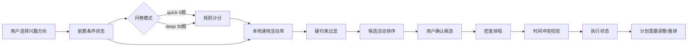

# 空闲时间规划 Agent 前端技术方案

## 1. 方案目标

围绕“突然拥有空闲时间后，不知道今天适合怎么过”的核心场景，前端采用低压力、分步式流程，优先完成半天以内的空闲规划闭环：

`兴趣方向 -> 前置条件 -> 5 题速测/30 题深测 -> 通用活动推荐 -> 计划密度 -> 时间线 -> 执行调整`

首版不依赖实时地图、商户或活动 API，活动均来自本地审核通用活动库。

## 2. 页面架构

### 2.1 页面层级

1. 欢迎页：产品定位、无需注册、开始规划。
2. 兴趣方向页：五个方向多选、优先级排序。
3. 前置条件页：时长、预算、出行、同行、节奏、只想休息；城市和工作状态选填。
4. 问卷页：默认 5 题速测，可切换 30 题深测；单题展示、自动保存、上一题、跳过、显式生成推荐。
5. 推荐页：通用活动候选、匹配理由、通用建议提示、数量不足提示。
6. 计划页：轻松留白、张弛平衡、充实一点三档密度，生成时间线。
7. 执行页：开始、完成、跳过、换一个、今天先不做、计划需要调整。
8. 总结页：确认计划、网页展示；PDF 和邮件按钮显示后续接入状态。

### 2.2 响应式策略

- 桌面端：左侧流程导航 + 右侧主内容区。
- 平板端：缩短侧栏，候选任务和时间线双栏排列。
- 移动端：侧栏隐藏，所有卡片和控件单列堆叠。
- 选项按钮最小点击高度建议 44px；避免横向滚动。
- 时间线在移动端保持“时间标签 + 任务块”结构，不改为不可读的宽表格。

## 3. 视觉系统

### 3.1 设计关键词

低压力、可执行、清晰、留白、轻量反馈。

### 3.2 颜色

| 用途 | 建议颜色 |
| --- | --- |
| 主文字 | `#14213D` |
| 次要文字 | `#667085` |
| 主色 | `#2864DC` |
| 主色浅底 | `#EAF1FF` |
| 完成/休息 | `#16866B` |
| 需要调整 | `#C66B16` |
| 页面背景 | `#F4F7FB` |

颜色不单独承担状态含义；状态同时使用文字、图标或结构提示。

### 3.3 组件

- `AppShell`：品牌、进度、阶段导航、状态提示。
- `ChoiceGroup`：兴趣、预算、出行和同行条件。
- `QuestionCard`：单题、四级量表、进度、上一题和跳过。
- `ActivityCard`：标题、方向、时长、预算、通用建议标签、匹配理由。
- `Timeline`：时间标签、任务块、休息块、状态标记。
- `CustomTaskDialog`：名称、方向、开始时间、持续时间、预算、可选原因标签。
- `AdjustmentBanner`：计划需要调整、立即重排、换一个、今天先不做。
- `DeliveryActions`：网页确认、PDF/邮件测试状态。

## 4. 前端状态模型

```js
{
  stage: 'welcome',
  preferences: {
    selectedCategories: [],
    mode: 'quick',
    duration: 'half-day',
    budget: 'medium',
    outing: 'near',
    company: 'either',
    density: 'balanced',
    restFirst: false,
    city: '',
    workStatus: ''
  },
  questionnaire: {
    mode: 'quick',
    questions: [],
    currentIndex: 0,
    answers: {}
  },
  candidates: [],
  selectedTasks: [],
  customTasks: [],
  schedule: [],
  executionState: {},
  ui: { message: '' }
}
```

状态更新采用单向流程：用户动作 -> action handler -> 纯函数更新 -> 保存 -> 重新渲染。页面不直接修改 DOM 中的业务数据。

## 5. 逻辑模块边界

### `logic.js`

保持浏览器和 CommonJS 双兼容，提供纯函数：

- `createQuestionnaire(mode, selectedCategories)`：生成 5/30 题。
- `getActivityLibrary()`：返回通用活动库副本。
- `filterActivities(preferences)`：执行硬约束过滤。
- `recommendActivities(preferences, answers, count)`：按方向、问卷和休息偏好排序；补位只能放宽方向类别，不得突破预算、时长、出行和同行条件。
- `buildSchedule(tasks, preferences)`：生成时间线和休息块。
- `validateTimeWindow(task, schedule, preferences)`：校验时间窗与重叠。
- `addCustomTask(state, input)`：验证并加入自定义任务。
- `updateTaskStatus(state, taskId, status)`：记录执行状态和计划调整提示。

### `app.js`

负责：

- 阶段渲染和事件委托。
- 前置条件和问卷交互。
- `localStorage` 版本化保存、恢复和损坏清理。
- 推荐结果、时间线、自定义任务和执行卡片的渲染。
- PDF、邮件等后续能力的测试状态提示。

### `styles.css`

负责视觉系统、响应式布局、表单控件、时间线、提醒、弹窗和移动端适配。避免把业务状态写在 CSS 中；状态由语义 class 和文本共同表达。

## 6. 数据流



## 7. 通用活动库

活动采用结构化字段：

```js
{
  id: 'park-bench',
  title: '去绿地坐坐再散步',
  category: 'calm',
  duration: 75,
  budget: 'free',
  mode: 'near',
  company: 'either',
  energy: 'low',
  restFirst: true,
  reason: '能保留一点外出感，又不过度消耗。'
}
```

首期允许的活动表述是通用类型，例如喝咖啡、去公园散步、看电影、听音乐、阅读、居家拉伸、整理房间、学习新技能、和朋友吃饭。不得填入未经验证的具体商户、价格、营业时间、距离和活动是否正在进行。

## 8. 执行与容错

- 未选择兴趣方向：阻止进入前置条件。
- 跳过问卷：使用中性分，不阻断生成。
- 任务不足 10 条：显示实际数量和原因，不突破硬约束凑数。
- 自定义任务原因标签：空值合法。
- 时间重叠：阻止保存并给出最近可用时段。
- 未开始、超时或跳过：界面显示“计划需要调整”。
- 重排：只操作未完成任务，不覆盖已完成任务状态。
- `localStorage`：只清理 Demo V2 自己的版本化 key，不触碰其他站点数据。
- PDF/邮件：首版显示“测试版暂未接入”，不伪造发送成功。

## 9. 后续技术演进

### MVP

- 原生 HTML/CSS/JS 验证流程。
- 本地活动库。
- `localStorage` 会话恢复。
- 规则推荐和规则排程。

### 第二阶段

- 将活动库抽为 JSON/数据库服务。
- 增加地图、活动和商户 Provider 适配器，仍只用于搜索推荐。
- 接入真实 PDF 渲染、邮件发送和日历 Provider。
- 增加账号、历史问卷复用和常用条件回填。

### 生产化建议

- 前端可迁移到 React/Vue + TypeScript，但保留 `logic.js` 中的纯函数边界。
- 规则推荐和 Agent 推荐分层：Agent 只在硬约束过滤后解释和排序，不生成事实数据。
- 所有外部数据增加 `provider`、`retrievedAt`、`freshness` 和 `sourceType` 字段。
- 日历写入采用用户最终确认后的一次性批量操作。

## 10. 验收指标

- 首屏到生成推荐的完成率。
- 5 题速测完成率和深测切换率。
- 推荐结果中硬约束违规数必须为 0。
- 候选任务替换率和计划确认率。
- 自定义任务保存成功率。
- 计划需要调整后的继续执行率。
- 低压力任务和“今天只想休息”入口使用率。
