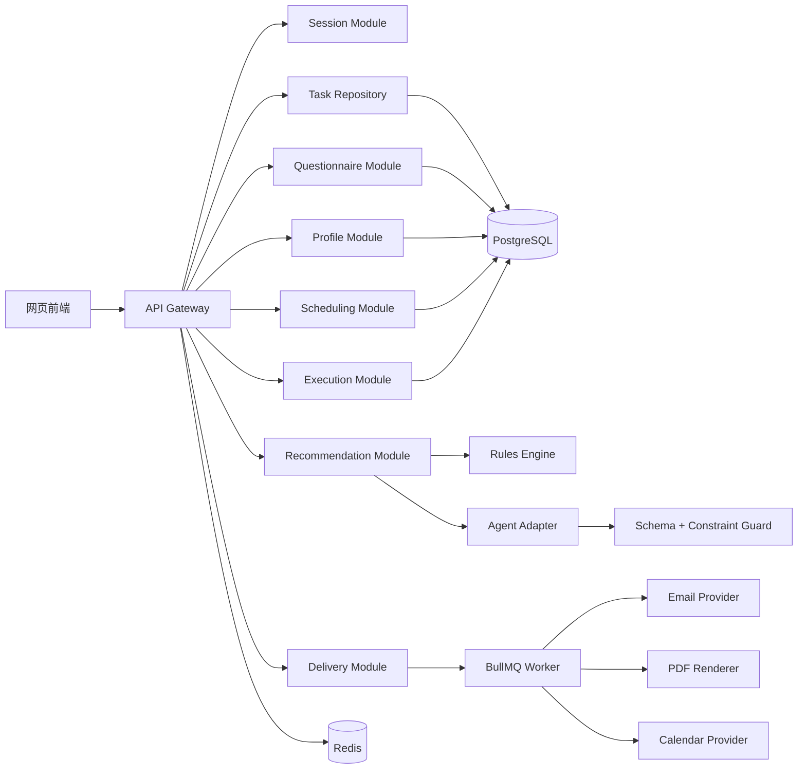

# 空闲时间规划 Agent 后端技术方案

## 1. 方案目标

后端负责把用户的空闲条件和问卷答案转化为一份可执行、可调整、可追踪的半天空闲计划，覆盖：

`会话 -> 前置条件 -> 问卷 -> 偏好画像 -> 任务筛选 -> Agent 推荐 -> 排程 -> 执行状态 -> 反馈 -> 交付`

首版必须在没有实时地图、商户和活动 API 的情况下独立运行，使用人工审核的通用活动库完成推荐；外部 Provider 在第二阶段通过适配器接入。

## 2. 推荐技术栈

| 层 | 选择 | 原因 |
| --- | --- | --- |
| API 服务 | Node.js + TypeScript + NestJS/Fastify | 适合结构化模块、DTO 校验、异步任务和后续 Provider 接入 |
| 数据库 | PostgreSQL | 保存题库、任务库、计划、执行事件、授权和反馈；支持 JSONB 扩展字段 |
| 缓存与队列 | Redis + BullMQ | 保存短期会话、幂等键、通知任务、邮件/PDF 任务和重排任务 |
| ORM/迁移 | Prisma 或 Drizzle | 类型安全、迁移可追踪、适合 MVP 快速迭代 |
| 对象存储 | S3 兼容存储 | 保存 PDF 快照和临时导出文件，使用短时签名 URL |
| 认证 | 匿名 session token + OAuth/OIDC | 匿名优先，登录后增强历史计划和日历能力 |
| 观测 | OpenTelemetry + Prometheus/Grafana + Sentry | 跟踪推荐成功率、队列耗时、外部 Provider 故障和错误 |

### 2.1 部署形态

MVP 采用“模块化单体 + 独立 Worker”结构，不拆微服务：

- `api`：HTTP API、会话、问卷、推荐、排程、执行和交付入口。
- `worker`：通知、邮件、PDF、日历同步和重排任务。
- `postgres`：主数据存储。
- `redis`：缓存、队列和短期锁。

当推荐、通知或 Provider 负载明显增长时，再将对应模块拆为独立服务。

## 3. 后端模块



### 3.1 Session Module

职责：

- 匿名创建和恢复规划会话。
- 生成不可预测的 session token。
- 保存问卷草稿、前置条件和当前阶段。
- 控制草稿有效期和删除本次数据。
- 登录后将匿名会话合并到用户账户。

匿名会话默认只保存必要数据；敏感字段和精确定位数据必须在单独授权后写入。

### 3.2 Questionnaire Module

职责：

- 从审核题库生成 quick 5 题或 deep 30 题。
- 根据方向优先级、身份、出行和同行条件筛选题目。
- 校验题数、选项、反向计分标记和题库版本。
- 接收答案、跳过记录和模式切换。
- 生成结构化作答结果，不直接让 Agent 解释原始答案。

### 3.3 Profile Module

将答案转换为结构化画像，例如：

```json
{
  "energyNeed": 0.72,
  "recoveryNeed": 0.84,
  "socialPreference": 0.34,
  "explorationPreference": 0.61,
  "growthPreference": 0.48,
  "budgetPreference": "low",
  "outingPreference": "near",
  "companyPreference": "solo",
  "confidence": 0.76,
  "source": "rule-v1"
}
```

基础计分由规则服务完成，Agent 只能消费画像结果和已筛选任务集，不能自行修改分数或创建不存在的事实。

### 3.4 Task Repository

MVP 以审核任务库为唯一可靠来源。每个任务包含：

- 方向标签和休息优先标记。
- 通用任务名称与说明。
- 预计时长、预算等级、活动方式、同行方式。
- 精力需求、适用时段和适用身份。
- 来源类型：`reviewed_generic`。
- 审核状态、审核人、审核时间、版本号。

任务库不保存未经核实的商户价格、营业时间、距离或实时活动状态。没有城市时，只返回居家或通用任务。

### 3.5 Recommendation Module

采用三层推荐流程：

1. **硬约束过滤**：预算、时长、出行、同行、城市/校园范围、休息优先。
2. **规则排序**：方向优先级、画像分数、活动启动成本、任务多样性。
3. **Agent 解释与组合**：只对已过滤的任务进行排序解释、匹配理由和计划建议。

当硬约束下不足 10 个任务时，最多只放宽方向类别，不放宽预算、时长、出行和同行条件；接口返回实际数量和 `fallbackUsed`，前端明确提示“当前条件下可用任务较少”。

Agent 输出必须经过 JSON Schema 和业务约束校验；失败一次后使用规则排序结果，不向用户暴露模型错误。

### 3.6 Scheduling Module

职责：

- 生成 `light / balanced / full` 三档计划。
- 控制总时长、任务间缓冲和至少一个休息块。
- 校验自定义开始时间、持续时间和现有计划冲突。
- 只对未完成任务重排，不覆盖已完成任务。
- 在任务未开始、超时或跳过时生成“计划需要调整”事件。

推荐排程算法顺序：

1. 固定用户已经确认的任务和不可用时间。
2. 对候选任务按方向覆盖、匹配分和时长排序。
3. 按计划密度插入任务和休息块。
4. 校验总时长、预算、重叠和可用窗口。
5. 返回时间线、未安排任务和调整原因。

### 3.7 Execution Module

执行状态建议使用状态机：

```text
pending -> active -> completed
pending -> skipped
pending -> missed
active  -> overdue
missed/overdue/skipped -> needs_adjustment
needs_adjustment -> rescheduled | replaced | paused
```

数据库内部可以保留 `missed` 和 `overdue`，用户界面统一展示“计划需要调整”。每个状态变化都写入不可变 `execution_events`，避免只依赖当前状态无法分析过程。

### 3.8 Delivery Module

提供统一计划快照：

- 网页：直接读取计划当前版本。
- PDF：将确认后的计划快照放入队列，生成短时签名 URL。
- 邮件：用户主动勾选单次发送授权后，发送同一份快照。

邮件、PDF 和网页必须使用同一 `plan_snapshot`，避免三种交付内容不一致。

## 4. 数据模型

### 4.1 核心表

| 表 | 关键字段 | 说明 |
| --- | --- | --- |
| `users` | `id`, `email_hash`, `created_at`, `deleted_at` | 登录用户；邮箱不作为公开标识 |
| `anonymous_sessions` | `id`, `token_hash`, `expires_at`, `consent_json` | 匿名会话和独立授权 |
| `planning_sessions` | `id`, `user_id`, `anonymous_session_id`, `stage`, `version` | 一次规划流程 |
| `preferences` | `session_id`, `categories_json`, `duration`, `budget`, `outing`, `company`, `density` | 前置条件 |
| `question_bank` | `id`, `mode`, `category`, `prompt`, `options_json`, `reverse`, `version`, `status` | 审核题库 |
| `questionnaire_answers` | `session_id`, `question_id`, `value`, `skipped`, `answered_at` | 原始作答 |
| `profiles` | `session_id`, `scores_json`, `confidence`, `rule_version` | 结构化画像 |
| `tasks` | `id`, `category`, `title`, `duration`, `budget`, `mode`, `company`, `rest_first`, `review_status` | 审核任务库 |
| `recommendation_runs` | `id`, `session_id`, `input_hash`, `model`, `fallback_used`, `status` | 一次推荐运行 |
| `recommendation_items` | `run_id`, `task_id`, `rank`, `score`, `reason` | 候选任务和解释 |
| `plans` | `id`, `session_id`, `version`, `status`, `density`, `confirmed_at` | 计划版本 |
| `plan_items` | `plan_id`, `task_id`, `start_at`, `end_at`, `item_type`, `status` | 时间线项目和休息块 |
| `custom_tasks` | `session_id`, `title`, `category`, `start_at`, `duration`, `reason_tag` | 用户自定义任务 |
| `execution_events` | `plan_item_id`, `event_type`, `occurred_at`, `metadata_json` | 执行事件流 |
| `feedback` | `plan_item_id`, `rating`, `reason_tags_json`, `created_at` | 满意度反馈 |
| `delivery_jobs` | `plan_id`, `type`, `status`, `attempts`, `expires_at` | PDF、邮件、日历任务 |
| `consents` | `session_id/user_id`, `scope`, `granted_at`, `revoked_at` | 精确授权记录 |

### 4.2 计划版本

计划采用不可覆盖的版本记录：

- 用户每次确认或重新排程生成新版本。
- `plans.parent_plan_id` 关联上一个版本。
- 已完成的 `plan_items` 在新版本中复制为锁定项。
- 写入外部日历的事件保存 `external_event_id`，产品不会自动删除，除非用户再次确认。

## 5. API 设计

所有接口统一返回：

```json
{
  "requestId": "req_xxx",
  "data": {},
  "error": null
}
```

### 5.1 会话和问卷

```text
POST   /api/v1/sessions
GET    /api/v1/sessions/:sessionId
DELETE /api/v1/sessions/:sessionId/data

POST   /api/v1/sessions/:sessionId/preferences
POST   /api/v1/sessions/:sessionId/questionnaire/start
PATCH  /api/v1/sessions/:sessionId/questionnaire/answers/:questionId
POST   /api/v1/sessions/:sessionId/questionnaire/skip/:questionId
POST   /api/v1/sessions/:sessionId/questionnaire/submit
POST   /api/v1/sessions/:sessionId/questionnaire/switch-mode
```

### 5.2 推荐和排程

```text
POST /api/v1/sessions/:sessionId/recommendations
GET  /api/v1/recommendations/:runId
POST /api/v1/sessions/:sessionId/plans/draft
PATCH /api/v1/plans/:planId/items/:itemId
POST /api/v1/plans/:planId/replan
POST /api/v1/plans/:planId/confirm
POST /api/v1/plans/:planId/custom-tasks
```

### 5.3 执行和反馈

```text
POST /api/v1/plans/:planId/items/:itemId/start
POST /api/v1/plans/:planId/items/:itemId/complete
POST /api/v1/plans/:planId/items/:itemId/skip
POST /api/v1/plans/:planId/items/:itemId/replace
POST /api/v1/plans/:planId/items/:itemId/pause
POST /api/v1/plans/:planId/items/:itemId/feedback
```

### 5.4 交付和授权

```text
POST /api/v1/plans/:planId/delivery/pdf
POST /api/v1/plans/:planId/delivery/email
GET  /api/v1/delivery-jobs/:jobId

POST /api/v1/consents
DELETE /api/v1/consents/:scope
POST /api/v1/calendar/connect
POST /api/v1/calendar/read
POST /api/v1/calendar/write
```

## 6. Agent 接口与安全边界

### 6.1 Agent 输入

只传递最少必要字段：

```json
{
  "profile": { "energyNeed": 0.72, "recoveryNeed": 0.84 },
  "constraints": {
    "duration": "half-day",
    "budget": "low",
    "outing": "near",
    "company": "solo",
    "density": "light"
  },
  "tasks": [
    { "id": "park-bench", "title": "去绿地坐坐再散步", "duration": 75, "budget": "free" }
  ]
}
```

不将邮箱、精确位置、日历事件详情和原始敏感回答直接发送给 Agent。

### 6.2 Agent 输出

输出必须符合结构化 Schema：

```json
{
  "summary": "string",
  "selectedTaskIds": ["string"],
  "reasons": [{ "taskId": "string", "text": "string" }],
  "scheduleSuggestion": [{ "taskId": "string", "relativeOrder": 1 }],
  "alternatives": [{ "taskId": "string", "reason": "string" }]
}
```

业务校验：

- `taskId` 必须来自输入任务集。
- 不能产生未输入的地点、商户、价格或营业信息。
- 不能违反预算、时长、出行和同行条件。
- 必须覆盖用户选择的方向；无法覆盖时返回结构化缺口，由规则层处理。
- 输出失败或超时时，直接使用规则推荐，不重试超过一次。

## 7. 异步任务和提醒

### 7.1 队列

| 队列 | 触发 | 失败处理 |
| --- | --- | --- |
| `notification` | 开始前 5/10/15/30 分钟 | 指数退避，页面通知仍可用 |
| `execution-check` | 到达开始时间、结束时间 | 幂等更新为 missed/overdue |
| `replan` | 用户点击立即重排 | 保留已完成项，生成新计划版本 |
| `pdf-export` | 用户请求 PDF | 保留网页计划，允许重试 |
| `email-delivery` | 用户单次授权发送 | 失败不重复发送，需用户重试 |
| `calendar-sync` | 用户确认后读写日历 | Provider 错误不重复创建事件 |

所有队列任务必须有 `jobId`、幂等键、最大重试次数和死信记录。

### 7.2 任务失败判定

使用服务端时间作为最终依据：

- 到达 `start_at` 后仍未收到 start 事件，标记 `missed`。
- 收到 start 但超过 `end_at` 未完成，标记 `overdue`。
- 用户跳过或今天先不做，写入对应事件。
- 对用户显示“计划需要调整”，不显示对抗性的“失败”。

## 8. 外部 Provider 适配器

所有外部能力使用接口隔离：

```ts
interface LivePlaceProvider {
  search(input: SearchInput): Promise<LivePlace[]>;
}

interface CalendarProvider {
  readBusyWindows(input: CalendarReadInput): Promise<BusyWindow[]>;
  createEvents(input: CalendarWriteInput): Promise<CalendarWriteResult>;
}

interface DeliveryProvider {
  sendEmail(input: EmailInput): Promise<DeliveryResult>;
  renderPdf(input: PlanSnapshot): Promise<FileResult>;
}
```

MVP 使用：

- `ReviewedTaskProvider`：本地审核任务库。
- `NoopCalendarProvider`：返回未接入提示。
- `NoopDeliveryProvider`：返回测试版未接入状态。

第二阶段再接入地图、活动、商户、Google/Outlook 日历、邮件和 PDF Provider。实时 API 只用于搜索与推荐，不提供预约、购票和支付。

## 9. 隐私与安全

- 匿名会话 token 使用哈希存储，不在日志中打印原始 token。
- 接口按 session/user 权限校验，禁止通过可猜 ID 读取其他用户计划。
- 邮箱只在单次邮件授权有效期内使用；长期档案保存哈希或加密值。
- 精确定位、日历读取、日历写入、浏览器通知分别授权、分别撤销。
- 原始问卷答案与画像分开存储，删除本次数据时级联删除。
- 日志脱敏：不记录邮箱、精确地址、日历标题和完整问卷答案。
- Agent 请求和输出保留审计 ID，不保留不必要的个人信息。
- 所有写接口支持幂等键，防止重复创建计划、事件和投递。
- 采用 HTTPS、短期访问令牌、CSRF 防护、输入校验和速率限制。

## 10. 观测与指标

### 技术指标

- API P95 延迟和错误率。
- 问卷保存成功率和恢复成功率。
- 推荐生成耗时、规则降级率、Agent Schema 失败率。
- 排程冲突率和无可用任务率。
- 通知、PDF、邮件和日历队列成功率。
- 重复事件写入数必须为 0。

### 产品指标

- 5 题速测完成率、深测切换率。
- 从创建会话到生成推荐的耗时。
- 推荐硬约束违规数必须为 0。
- 计划确认率、任务开始率、任务完成率。
- 计划需要调整后的继续执行率。
- 自定义任务保存率和满意度反馈率。

## 11. 分阶段落地

### MVP

1. 模块化单体 API、PostgreSQL、Redis。
2. 匿名会话、前置条件、5/30 题问卷、规则画像。
3. 单城市/单校园人工审核任务库。
4. 规则推荐、硬约束校验、10 个候选和三档排程。
5. 执行状态、计划需要调整、重排和反馈。
6. 网页交付；PDF、邮件、日历返回未接入状态。

### 第二阶段

1. 实时地图/活动/商户 Provider。
2. PDF、邮件和浏览器通知 Worker。
3. 日历读取与用户确认后批量写入。
4. 登录、历史问卷复用、常用条件回填。
5. 更多城市和校园任务库。

### 生产化阶段

1. Agent 服务独立扩展，规则服务继续保留最终约束权。
2. Provider 数据增加 `provider`、`retrievedAt`、`freshness` 和 `sourceType`。
3. 任务库增加审核后台、过期策略和版本回滚。
4. 建立推荐离线评估集、排程冲突回放和执行漏斗分析。
