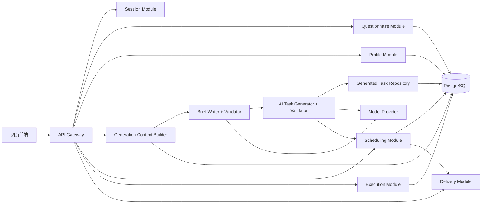

# 空闲时间规划 Agent 后端技术方案

> 状态：现有规则版 MVP 与拟接入 AI 的目标方案合并稿。AI 任务生成部分是待实现设计，不代表当前线上功能已切换。早期 MVP 方案保留在 `空闲时间规划Agent-MVP-后端技术方案.md` 作为历史基线。

## 1. 方案目标

后端负责把用户的空闲条件和问卷答案转化为一份可执行、可调整、可追踪的半天空闲计划，覆盖：

`会话 -> 前置条件 -> 问卷 -> 偏好画像 -> 生成上下文 -> AI 自写生成说明 -> AI 生成候选任务与理由 -> 后端校验并持久化 -> 预算感知排程 -> 执行状态 -> 反馈 -> 网页交付`

当前规则版仍使用人工审核任务库。目标 AI 版本由模型生成任务内容；原任务库不参与首次生成、更换或失败补足，问卷题库仍继续使用。AI 不决定起止时间、执行状态和反馈，也不写数据库。没有实时地图、商户和活动 API 时，只能生成可核对的通用活动，不得编造具体店铺、价格或营业信息。

## 2. 推荐技术栈

| 层 | 选择 | 原因 |
| --- | --- | --- |
| API 服务 | Python + FastAPI | 沿用当前 `main.py` 与领域模块，不为接入模型重写后端 |
| 数据库 | PostgreSQL + psycopg | 保存问卷、画像、AI 生成记录、计划、执行和反馈 |
| 模型适配 | 服务端 `AIModelClient` | 配置模型 ID、Base URL、超时与 API Key；前端不接触密钥 |
| 前端与部署 | 现有网页 + Vercel / PostgreSQL | 保留已有接口外形，线上配置服务端环境变量 |
| 认证与队列 | 后续按需接入 | 登录、异步通知、PDF、邮件和日历不作为 AI 生成的前置条件 |

### 2.1 部署形态

目标版本沿用模块化单体，不拆微服务：

- `api`：HTTP API、会话、问卷、推荐、排程、执行和交付入口。
- `ai-client`：仅由服务端调用模型，负责限时、用量和错误分类。
- `postgres`：主数据存储。
- 未来的 Worker/Redis：通知、邮件、PDF 或较长耗时的异步任务确有需要时再引入。

模型调用仍受部署平台运行时长和费用限制；生成可先采用同步请求，超时返回可重试错误，不偷偷回退旧任务库。

## 3. 后端模块



### 3.1 Session Module

职责：

- 匿名创建和恢复规划会话。
- 生成不可预测的 session token。
- 保存问卷草稿、前置条件和当前阶段。
- 控制草稿有效期和删除本次数据。
- 登录后将匿名会话合并到用户账户。

匿名会话默认只保存必要数据；敏感字段和精确定位数据必须在单独授权后写入。

### 3.2 Questionnaire Module

职责：

- 从审核题库生成 quick 5 题或 deep 30 题。
- 根据方向优先级、身份、出行和同行条件筛选题目。
- 校验题数、选项、反向计分标记和题库版本。
- 接收答案、跳过记录和模式切换。
- 生成结构化作答结果；规则画像先行，模型只读取生成任务确实需要的题目与真实答案证据。

### 3.3 Profile Module

将答案转换为结构化画像，例如：

```json
{
  "energyNeed": 0.72,
  "recoveryNeed": 0.84,
  "socialPreference": 0.34,
  "explorationPreference": 0.61,
  "growthPreference": 0.48,
  "budgetPreference": "low",
  "outingPreference": "near",
  "companyPreference": "solo",
  "confidence": 0.76,
  "source": "rule-v1"
}
```

基础计分由规则服务完成。模型可读取画像快照与原始作答证据，但不能自行修改分数；跳过题保持“未知”，不得被解释为确定偏好。

### 3.4 Generated Task Repository

目标版本的任务内容由 AI 产生，经后端校验后写入 `generated_tasks`，后续替换、执行、反馈和历史都通过稳定 `task_id` 查找。旧 `tasks` 表可留作历史兼容，不参与 AI 首次生成、更换或失败补足。每条任务保存生成 ID、会话 ID、分类、标题、时长、预计预算、负担元数据、第一步、前置条件、可选后续步骤、生成理由、推荐原因、证据引用、语义签名及校验状态。无用户提供地点或实时地点服务时，不得断言具体店铺、营业时间或准确价格。

### 3.5 Recommendation Module

目标版本采用后端编排的双阶段生成，不让模型直接访问数据库：

1. `GenerationContextBuilder` 从已保存的兴趣方向、预算和时间等硬条件、当前精力/天气、问卷原始证据、规则画像及历史反馈构建同版本快照。优先级为安全与显式排除 > 硬条件 > 本次选择 > 当前状态 > 问卷画像 > 历史软偏好 > 多样性。
2. `BriefWriter` 读取服务端固定规则和快照，输出带证据引用的结构化 `GenerationBrief`，列明必须满足、优先满足、禁止推荐、未确认信息、方向覆盖和目标数量。它是待核验的数据，不是新的 system 指令。`BriefValidator` 确认硬限制未丢失、跳过题未被当成偏好、地点和预算未被编造。
3. `TaskGenerator` 用通过校验的说明和必要证据生成目标 10 项任务，每项包含第一步、前置条件、两类理由和证据引用。`TaskValidator` 做结构、硬条件、理由一致性与会话内语义去重；被拒绝项最多定向补写一次。候选不足时返回真实数量和缺口，不从旧任务库补齐。

生成理由解释任务如何从本次输入构造；推荐原因解释为什么适合当前用户。模型不产生计划起止时间，不得声明自己已通过校验；后端负责最终验收和持久化。连续“换一个”时排除当前任务及此会话已出现的具体任务；需要新内容时再次调用模型，后端验证后才可替换。

### 3.6 Scheduling Module

职责：

- 生成 `light / balanced / full` 三档计划。
- 控制总时长、任务间缓冲和至少一个休息块。
- 校验自定义开始时间、持续时间和现有计划冲突。
- 条件变化时只重排尚未开始且未锁定的任务，不覆盖已完成、进行中、已跳过和用户锁定的记录或反馈。
- 在任务未开始、超时或跳过时生成“计划需要调整”事件。

推荐排程算法顺序：

1. 固定用户已经确认的任务和不可用时间。
2. 对 AI 候选按方向覆盖、适配度和时长排序；不要求十项都排入时间线。
3. 按计划密度、剩余时间和剩余预算插入任务与休息块；下一项会使计划预计总额超限时，将它保留为待安排候选并注明“预算不足”。
4. 复核已排任务总时长、总预算、重叠和可用窗口，验收通过后才保存计划。
5. 返回时间线、未安排候选及逐项原因；加入或替换计划项时重新核算预算，替换先扣除原计划项。

候选任务只需逐项不超过用户预算上限，十项候选花费之和可以超过上限；计划总预算只计算真正排进时间线的任务。已完成任务优先用实际支出核算，未记录实际支出时用预计值并标注估算。天气、精力、出行或可用时间变化后，前端保存版本化 `current_context`，后端只移动未开始且未锁定的任务；无法继续安排的任务转为待安排并说明原因。锁定或进行中的任务若与新条件冲突，保留记录并提示用户处理，不自动移动。纯重排不调用模型；仅用户要求新替代任务时才调用。

### 3.7 Execution Module

执行状态建议使用状态机：

```text
pending -> active -> completed
pending -> skipped
pending -> missed
active  -> overdue
missed/overdue/skipped -> needs_adjustment
needs_adjustment -> rescheduled | replaced | paused
```

数据库内部可以保留 `missed` 和 `overdue`，用户界面统一展示“计划需要调整”。每个状态变化都写入不可变 `execution_events`，避免只依赖当前状态无法分析过程。

### 3.8 Delivery Module

当前只要求网页读取计划当前版本，并展示推荐理由、第一步、前置条件、预算摘要和待安排原因。PDF、邮件、日历是未来扩展；如启用，须使用同一 `plan_snapshot`，不得与网页内容不一致。

## 4. 数据模型

### 4.1 核心表

| 表 | 关键字段 | 说明 |
| --- | --- | --- |
| `users` | `id`, `email_hash`, `created_at`, `deleted_at` | 登录用户；邮箱不作为公开标识 |
| `anonymous_sessions` | `id`, `token_hash`, `expires_at`, `consent_json` | 匿名会话和独立授权 |
| `planning_sessions` | `id`, `user_id`, `anonymous_session_id`, `stage`, `version` | 一次规划流程 |
| `preferences` | `session_id`, `categories_json`, `duration`, `budget`, `outing`, `company`, `density` | 前置条件 |
| `question_bank` | `id`, `mode`, `category`, `prompt`, `options_json`, `reverse`, `version`, `status` | 审核题库 |
| `questionnaire_answers` | `session_id`, `question_id`, `value`, `skipped`, `answered_at` | 原始作答 |
| `profiles` | `session_id`, `scores_json`, `confidence`, `rule_version` | 结构化画像 |
| `tasks` | 原有任务字段 | 规则版历史兼容；AI 版本不以此作为任务来源 |
| `ai_generation_runs` | `id`, `session_id`, `context_version`, `brief_json`, `prompt_version`, `model`, `usage_json`, `status` | 一次两阶段生成与校验记录 |
| `generated_tasks` | `id`, `generation_id`, `session_id`, `title`, `category`, `first_action`, `prerequisites_json`, `duration`, `estimated_budget`, `reasons_json`, `evidence_refs_json`, `semantic_signature` | 后端核验并保存的 AI 候选任务 |
| `task_exclusion_signatures` | `session_id`, `signature`, `reason`, `created_at` | 当前会话内的替换及显式排除记忆 |
| `recommendation_items` | `run_id`, `task_id`, `rank`, `reason` | 候选顺序和解释；引用 `generated_tasks.id` |
| `plans` | `id`, `session_id`, `version`, `status`, `density`, `confirmed_at` | 计划版本 |
| `plan_items` | `plan_id`, `task_id`, `start_at`, `end_at`, `item_type`, `status` | 时间线项目和休息块 |
| `custom_tasks` | `session_id`, `title`, `category`, `start_at`, `duration`, `reason_tag` | 用户自定义任务 |
| `execution_events` | `plan_item_id`, `event_type`, `occurred_at`, `metadata_json` | 执行事件流 |
| `feedback` | `plan_item_id`, `rating`, `reason_tags_json`, `created_at` | 满意度反馈 |
| `delivery_jobs` | `plan_id`, `type`, `status`, `attempts`, `expires_at` | PDF、邮件、日历任务 |
| `consents` | `session_id/user_id`, `scope`, `granted_at`, `revoked_at` | 精确授权记录 |

### 4.2 计划版本

计划采用不可覆盖的版本记录；`current_context` 也需带版本，与计划版本一起参与重排冲突检查：

- 用户每次确认或重新排程生成新版本。
- `plans.parent_plan_id` 关联上一个版本。
- 已完成的 `plan_items` 在新版本中复制为锁定项。
- 写入外部日历的事件保存 `external_event_id`，产品不会自动删除，除非用户再次确认。

## 5. API 设计

所有接口统一返回：

```json
{
  "requestId": "req_xxx",
  "data": {},
  "error": null
}
```

### 5.1 会话和问卷

```text
POST   /api/v1/sessions
GET    /api/v1/sessions/:sessionId
DELETE /api/v1/sessions/:sessionId/data

POST   /api/v1/sessions/:sessionId/preferences
POST   /api/v1/sessions/:sessionId/questionnaire/start
PATCH  /api/v1/sessions/:sessionId/questionnaire/answers/:questionId
POST   /api/v1/sessions/:sessionId/questionnaire/skip/:questionId
POST   /api/v1/sessions/:sessionId/questionnaire/submit
POST   /api/v1/sessions/:sessionId/questionnaire/switch-mode
```

### 5.2 推荐和排程

```text
POST /api/v1/sessions/:sessionId/plan/generate
GET  /api/v1/sessions/:sessionId/plan
PATCH /api/v1/plans/:planId/items/:itemId
POST /api/v1/plans/:planId/replan
POST /api/v1/plans/:planId/confirm
POST /api/v1/plans/:planId/custom-tasks
```

`plan/generate` 内部按“会话与问卷校验 -> 同版本画像 -> 上下文快照 -> BriefWriter -> BriefValidator -> TaskGenerator -> TaskValidator -> 保存 AI 任务 -> 预算感知排程 -> 总额复核 -> 保存计划和网页交付”执行。请求使用幂等键，避免重复点击导致两套任务与额外模型费用。返回结构尽量保持 `recommendation.tasks`、`task_ids`、`recommended_task_count`、`plan` 和 `delivery` 兼容现有前端。更换、调轻松等需要新内容的操作才调用模型；时间调整、纯重排、开始、完成、跳过和反馈不调用模型。

`replan` 请求建议包含 `expected_plan_version`、`current_context_version` 与新的剩余可用时间窗口。后端扣除已完成任务实际支出（没有实际值时用预计值）和尚未完成且不可移动任务的预计花费，再安排剩余任务；已跳过任务不占剩余预算。版本冲突返回可恢复错误，不覆盖刚发生的执行事件。响应包含新计划、预算摘要、待安排任务及原因。

### 5.3 执行和反馈

```text
POST /api/v1/plans/:planId/items/:itemId/start
POST /api/v1/plans/:planId/items/:itemId/complete
POST /api/v1/plans/:planId/items/:itemId/skip
POST /api/v1/plans/:planId/items/:itemId/replace
POST /api/v1/plans/:planId/items/:itemId/pause
POST /api/v1/plans/:planId/items/:itemId/feedback
```

### 5.4 交付和授权

```text
POST /api/v1/plans/:planId/delivery/pdf
POST /api/v1/plans/:planId/delivery/email
GET  /api/v1/delivery-jobs/:jobId

POST /api/v1/consents
DELETE /api/v1/consents/:scope
POST /api/v1/calendar/connect
POST /api/v1/calendar/read
POST /api/v1/calendar/write
```

## 6. Agent 接口与安全边界

### 6.1 模型输入与指令边界

服务端固定指令规定任务标准、约束优先级、结构和禁止事项。模型只收到生成所需的最小上下文：所选方向、硬性条件、当前状态、问卷题目与真实作答证据、确定性画像、可用历史反馈、已排除任务签名和目标任务数量。跳过题标为未知，空历史标为没有证据。姓名、邮箱、精确位置及无关敏感记录不送入模型。

第一次调用只生成 `GenerationBrief`：必须满足、优先满足、禁止项、未确认信息、方向覆盖、任务数量与每条要求的证据引用。后端对照原始输入验证；模型生成的说明是数据，不得提升为 system 指令。第二次调用才生成任务。两次可使用同一模型，但阶段顺序、调用次数和数据写入都由后端控制。

### 6.2 任务输出与后端验收

任务输出字段为 `title`、`category`、`first_action`、`prerequisites`、可选 `action_steps`、`duration_minutes`、`estimated_budget`、`outing`、`company`、`ease_level`、`physical_load`、`social_pressure`、`location_dependency`、`generation_reason`、`recommendation_reason`、`evidence_refs` 和 `uncertainty_note`。`first_action` 是前置条件满足后立即可做的具体动作；`prerequisites` 列明物品、场地、预约、费用和他人配合，可以为空列表但不能隐瞒必要条件。两类理由分别解释任务为何被构造、为何适合此人，且必须指向真实证据。后端分配稳定 `task_id`，模型不得自称任务已通过校验。

后端先验结构、枚举和数值，再验预算/时间/出行/同行等硬条件、第一步与前置条件一致性、理由真实性、安全边界和会话内语义去重。候选任务各自不得超过预算上限；只有排进时间线的任务参与计划总预算核算。模型输出失败、超时或合格任务不足时返回明确错误或实际数量，允许至多一次定向补写，不使用旧任务库或规则推荐悄悄补齐。API Key、完整个人上下文与供应商原始错误不得返回前端。

## 7. 异步任务和提醒（未来扩展）

下列队列属于原方案的未来能力，不是 AI 任务生成上线的依赖。当前执行状态、版本检查和重排仍由后端处理；只有确实需要长耗时任务时才接入 Worker。

### 7.1 队列

| 队列 | 触发 | 失败处理 |
| --- | --- | --- |
| `notification` | 开始前 5/10/15/30 分钟 | 指数退避，页面通知仍可用 |
| `execution-check` | 到达开始时间、结束时间 | 幂等更新为 missed/overdue |
| `replan` | 用户点击调整剩余安排 | 保留已完成、进行中和锁定项，生成新计划版本 |
| `pdf-export` | 用户请求 PDF | 保留网页计划，允许重试 |
| `email-delivery` | 用户单次授权发送 | 失败不重复发送，需用户重试 |
| `calendar-sync` | 用户确认后读写日历 | Provider 错误不重复创建事件 |

所有队列任务必须有 `jobId`、幂等键、最大重试次数和死信记录。

### 7.2 任务失败判定

使用服务端时间作为最终依据：

- 到达 `start_at` 后仍未收到 start 事件，标记 `missed`。
- 收到 start 但超过 `end_at` 未完成，标记 `overdue`。
- 用户跳过或今天先不做，写入对应事件。
- 对用户显示“计划需要调整”，不显示对抗性的“失败”。

## 8. 外部 Provider 适配器

所有外部能力使用接口隔离：

```ts
interface LivePlaceProvider {
  search(input: SearchInput): Promise<LivePlace[]>;
}

interface CalendarProvider {
  readBusyWindows(input: CalendarReadInput): Promise<BusyWindow[]>;
  createEvents(input: CalendarWriteInput): Promise<CalendarWriteResult>;
}

interface DeliveryProvider {
  sendEmail(input: EmailInput): Promise<DeliveryResult>;
  renderPdf(input: PlanSnapshot): Promise<FileResult>;
}
```

原规则版使用：

- `ReviewedTaskProvider`：本地审核任务库，仅供规则版历史兼容，不得作为 AI 生成、更换或失败补足来源。
- `NoopCalendarProvider`：返回未接入提示。
- `NoopDeliveryProvider`：返回测试版未接入状态。

未来可接入地图、活动、商户、Google/Outlook 日历、邮件和 PDF Provider。实时数据若接入，需标注来源与抓取时间；不可把未核实的外部事实当作模型已验证的结果，不提供预约、购票和支付。

## 9. 隐私与安全

- 匿名会话 token 使用哈希存储，不在日志中打印原始 token。
- 接口按 session/user 权限校验，禁止通过可猜 ID 读取其他用户计划。
- 邮箱只在单次邮件授权有效期内使用；长期档案保存哈希或加密值。
- 精确定位、日历读取、日历写入、浏览器通知分别授权、分别撤销。
- 原始问卷答案与画像分开存储，删除本次数据时级联删除。
- 日志脱敏：不记录邮箱、精确地址、日历标题和完整问卷答案。
- 模型请求和输出保留审计 ID、提示词版本及必要校验信息，不保留不必要的个人信息；API Key 只存服务端环境变量，不进入前端、GitHub、响应体或日志。
- 记录每阶段输入/输出 Token 与成本估算，限制每会话和每日调用量；额度用完或服务不可用时明确报错，不回退旧任务库。
- 所有写接口支持幂等键，防止重复创建计划、事件和投递。
- 采用 HTTPS、短期访问令牌、CSRF 防护、输入校验和速率限制。

## 10. 观测与指标

### 技术指标

- API P95 延迟和错误率。
- 问卷保存成功率和恢复成功率。
- 两阶段模型生成耗时、校验拒绝率、Schema 失败率、超时/限流率和 Token 成本。
- 排程冲突率和无可用任务率。
- 通知、PDF、邮件和日历队列成功率。
- 重复事件写入数必须为 0。

### 产品指标

- 5 题速测完成率、深测切换率。
- 从创建会话到生成推荐的耗时。
- 推荐硬约束违规数必须为 0。
- 计划确认率、任务开始率、任务完成率。
- 计划需要调整后的继续执行率。
- 自定义任务保存率和满意度反馈率。

## 11. 分阶段落地

### 当前规则版（已存在）

1. FastAPI 模块化后端、PostgreSQL、会话/问卷/规则画像。
2. 人工审核任务库、规则推荐、计划排程、执行和反馈。
3. 网页交付；AI 生成尚未接入。

### AI 目标版本（待实现）

1. 冻结 `GenerationBrief` 和 AI 任务字段，迁移生成记录、任务和排除签名表。
2. 接入模型客户端、上下文构建、两阶段生成与确定性校验，记录提示词版本与 Token 用量。
3. 让首次生成、更换和调节只引用 `generated_tasks`，不回退旧任务库。
4. 排程器增加预算感知，前端展示第一步、前置条件、两类理由和预算摘要。
5. 补齐带上下文版本的“只重排剩余任务”、假模型全链路测试及真实模型小样本验收，再上线。

### 后续扩展

按真实需求再接入账号、通知、地图/活动 Provider、日历、PDF 和邮件；保留后端对硬约束、预算与执行状态的最终控制权。

## 12. AI 目标版测试与验收

- 使用假模型测试两阶段调用、硬限制未丢失、跳过题不被当成偏好、虚构依据拒绝、语义去重、一次定向补写、限流/超时、无旧库回退与生成幂等。
- 验证每个候选单项花费不超预算；十项候选合计超预算但已排计划未超预算时允许生成；加入或替换导致总额超限时保留为待安排并返回原因。
- 验证每项任务有具体 `first_action`、真实 `prerequisites`、两类可核对的理由与持久化的稳定 `task_id`；无合格任务时返回实际数量和缺口。
- 用已完成、进行中、已跳过、锁定、未开始及待安排项混合的计划测试条件变化；只移动剩余可动项，不抹除反馈，不重复扣除已完成支出。纯重排、时间调整、执行和反馈不得调用模型。
- 上线前以真实模型做少量匿名人工验收；上线后监测生成成功率、校验拒绝率、P95 耗时、Token 成本、计划完成率与用户评分。展示理由不能代替真实满意度和完成率指标。
